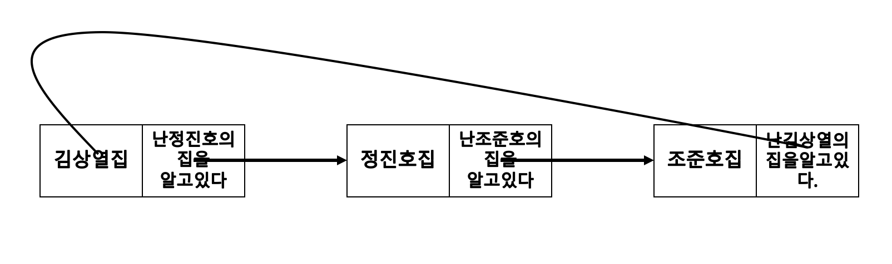
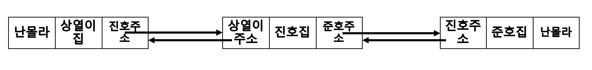

##LinkedList
 각 노드가 데이터와 포인터를 가지고 한 줄로 연결되어  있는 방식으로 데이터를 저장하는 자료구조이다. 
노드의 포인터가 다음이나 이전의 노드와의 연결을 담당하게 된다.

포인터로 나타내니깐 포인터를 알고있어야한다.

 노드는 기본적으로 구조체로 이루어져 있다.
 ```
 |데이터부 -링크부 | 로 이루어져 있다.
 ```


LinkedList는 이런 노드들의 집합으로 이루어져 있다.


- 단일 연결리스트


김상열은 정진호집의 주소를 알고 있으니 놀러갈 수 있다.
하지만 조준호의 집주소는 모르니 갈 수 없다.
이렇다 단순하게 하나의 주소밖에 모르는 구조 

중요한건  정진호는 자기집을 아는 김상열의 집주소는 알 수가 없다.  물론 조준호도 김상열의 주소를가지고 있지않다.(조준호는 아무것도 모름)
```
얘네들은 모두 하나이하 주소밖에 모르니깐
```

<br>
- 원형 연결리스트



아무것도 모르던 준호가  김상열의 집을 안다면 이 친구들은 서로의 집을 하나씩 알게 된다. 그래서  정진호는 김상열의 주소를 알고 싶다면 조준호집에가서 준호에게
 "야 나 김상열주소좀알려줘"하면
  김상열의 주소를 알 수 있다.  

<br>

- 이중연결리스트




이번엔 주소를 2개가지고 있는 형태이다. 그래서 바로 내기준에서 나의 바로 옆집에   주소를 가지고 있어서 옆집이 상열이라는 것을 알 수 있고, 또한 앞에 준호의 집도 알 수 있다. 그래서  양옆의 어떤 친구들이 사는 지 알 수 있다. 

하지만 준호는  집앞이 강이기 때문에 앞집의 주소를 가지고 있지않다. 
또 상열이도 뒤에 산이기 때문에 앞집은 알지만 뒷집은 산이라 뒷집주소를 가지고 있진 않다.
